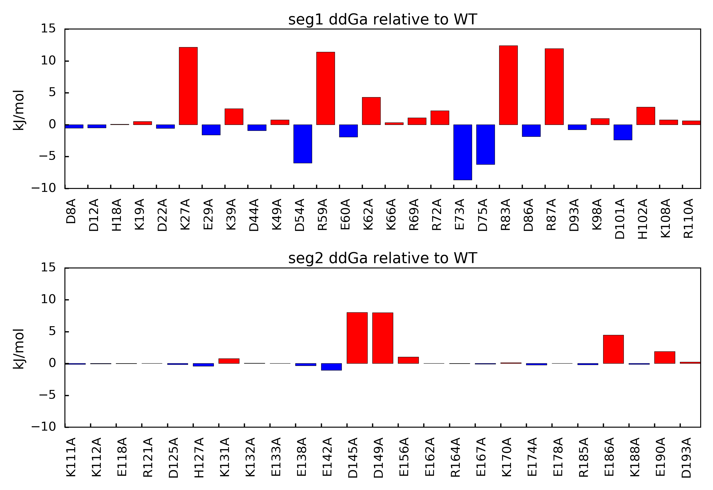

.. _alascan::

Alanine Scan
============

Given a PDB structure of atomistic resolution, the alanine scan method iteratively perturbs the native 
structure by mutating single amino acids to alanine one residue at a time. In this manner, the method 
can predict those mutations that are predicted to significantly affect the free energy of association for 
a complex according to the thermodynamic cycle. For reference, please refer to [Kieslich2011-2]_ and 
[Gorham2011-2]_ as they present published results for the Barnase-Barstar test system.

.. currentmodule:: aesop
.. autosummary::
    :toctree: api/generated/
    
    Alascan

Example case: Barnase-Barstar
"""""""""""""""""""""""""""""

Open a new python session, import the Alascan class, and import the plotScan function:: 

    from aesop import Alascan, plotScan, writePDB

Next, you must specify the full paths to your ``apbs``, ``coulomb``, and ``pdb2pqr`` executables, if 
the paths for the directories containing the executables have not already been added to the environment. 
Here is an example for a Windows system::

    path_apbs    = 'C:\\APBS\\apbs.exe'
    path_coulomb = 'C:\\APBS\\coulomb.exe'
    path_pdb2pqr = 'C:\\PDB2PQR\\pdb2pqr.exe'

Next we will specify the jobname and pdbfile to used in the method. After running the alanine scan, jobname 
will be used to create a folder where files for the method will be generated. You can download the PDB file 
for this example from this link (:download:`download<../data/barnase_barstar.pdb>`). 
Make sure you place the PDB in your working directory::

    jobname = 'alascan'
    pdbfile = 'barnase_barstar.pdb'

.. warning::

    If you are using your own PDB, make sure the PDB contains no missing heavy atoms. Consider also removing non-standard
    amino acids. PDBFixer is one option for cleaning PDB files in preparation for AESOP.

The Alascan class will need to know how to define each subunit of the protein complex. To do this, 
the user should specify a list of selection strings. Each element of the list should be a stand-alone 
selection string that fully describes how to select the associated subunit. If the selection string 
list has only 1 element, then be aware that you may only calculate solvation free energies as no 
association of subunits occurs. In this example, barnase is chain A, and barstar is chain B. Thus, 
we specify the selection string in the following manner::

    selstr = ['chain A', 'chain B']

Finally, we may initialize the Alanine scan class::

    alascan = Alascan(pdb=pdbfile, pdb2pqr_exe=path_pdb2pqr,
                      apbs_exe=path_apbs, coulomb_exe=path_coulomb,
                      jobname=jobname, selstr=selstr, minim=False)

Note that by default the Alanine scan class will not minimize the structure of mutants. Since the Alascan 
class seeks to quantify the electrostatic contribution of each amino acid, minimization is unnecessary for
our purposes. No clashes should be introduced by the side-chain truncation mutation scheme. If you still 
prefer to perform minimization, please set minim=True when the class is initialized. In either case, 
results with or without minimization should be extremely similar.

Alternatively, if paths to apbs, coulomb and pdb2pqr are already added to environment then you may initialize as follows::

    alascan = Alascan(pdb=pdbfile, jobname=jobname, selstr=selstr)
	
After initialization, you can run the analysis in series::

    alascan.run()

... or you can run the analysis in parallel on a certain number of threads (don't pass a number 
if you wish to use half of available threads)::

    alascan.run_parallel(6)

After the run is complete, AESOP will report if any Warnings or Errors were detected in APBS or PDB2PQR. 
The full logs are stored in the alascan.logs and can be viewed or written to file in the following manner::

    alascan.viewLogs()
	alascan.writeLogs(filename="alascan_logs.txt")
	
Once complete, you can view the results as a barplot::

    plotScan(alascan, filename='alascan.png')

You should end up with a figure similar to the following image:	
	

   
In this figure, mutations that result in positive ddGa values relative to the parent structure suggest loss of binding mutations. 
This outcome indicates the mutated amino acid was involved in an overall favorable network of electrostatic interactions in the 
parent structure. Mutations that result in negative ddGa values relative to the parent structure suggest gain of binding mutations. 
This outcome indicates the mutated amino acid was involved in an overall unfavorable network of electrostatic interactions in the 
parent structure.	

You may also extract the free energies of association and the associated mutation ids::

    mut_ids  = alascan.getMutids()
    energies = alascan.ddGa_rel()

If you wish, you can use build in function to summarize results. If the file name is not 
specified for the summary, then the summary is simply printed to STDOUT::

    alascan.summary(filename='alascan_summary.txt')
	
Finally, you may export a PDB file with ddGa values for each residue in the beta-factor column as follows::

    writePDB(alascan, filename='alascan.ddGa.pdb')

References
""""""""""

.. [Kieslich2011-2] `Kieslich, C.A., R.D. Gorham, and D. Morikis. 2011. Is the rigid-body assumption reasonable?: Insights into the effects of dynamics on the electrostatic analysis of barnase-barstar. J. Non. Cryst. Solids. 357: 707–716. <https://doi.org/10.1016/j.jnoncrysol.2010.05.087>`_.
.. [Gorham2011-2] `Gorham, R.D., C.A. Kieslich, A. Nichols, N.U. Sausman, M. Foronda, and D. Morikis. 2011. An evaluation of Poisson-Boltzmann electrostatic free energy calculations through comparison with experimental mutagenesis data. Biopolymers. 95: 746–754. <https://doi.org/10.1002/bip.21644>`_.
