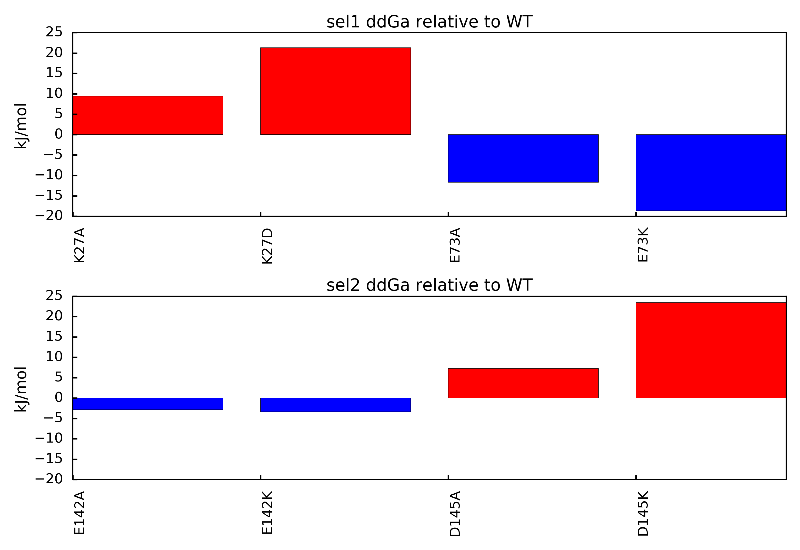

.. _directmutagenesis::

Directed Mutagenesis Scan
=========================

The directed mutagenesis scan is similar to the alanine scan, except it requires specific information 
about what mutations to perform. Additionally, this method requires an external python library named 
Modeller. This dependency facilitates more complicated mutations; however, it also requires the method 
to perform more calculations than for the side-chain truncation method of the alanine scan. For 
reference, please refer to [Kieslich2011-2]_ and [Gorham2011-2]_ as they present published results 
for the Barnase-Barstar test system. You may download all necessary files for this example at this 
link: :download:`download<../data/directed_mutagenesis.zip>`.

.. currentmodule:: aesop
.. autosummary::
	:toctree: api/generated/
	
	DirectedMutagenesis

Example case: Barnase-Barstar
"""""""""""""""""""""""""""""

Open a new python session, import the DirectedMutagenesis class, and import the plotScan function:: 

    from aesop import DirectedMutagenesis, plotScan, writePDB

.. warning::
	
	If you are planning to leverage multiple CPU threads for a faster analysis, please know 
	that extra steps may be required. Specifically, you must protect the entry point of the 
	program according to multiprocessing documentation. You may do this by putting the following 
	code at the beginning of your Python script::
	
		if __name__ == '__main__':
		    # place remaining code here and maintain level of indentation
			
	This precaution becomes unnecessary if you are running the analysis inside an interactive 
	Python session. In the downloadable zip files, we have already placed this protection in 
	the run script, so that you may run the analysis as follows in your platform's terminal::
	
		python run_mutagenesis.py
		
	Failure to protect the entry point may result in an infinite loop of process spawning.
	
Next, you must specify the full paths to your ``apbs``, ``coulomb``, and ``pdb2pqr`` executables, if 
the paths for the directories containing the executables have not already been added to the environment. 
Here is an example for a Windows system::

    path_apbs    = 'C:\\APBS\\apbs.exe'
    path_coulomb = 'C:\\APBS\\coulomb.exe'
    path_pdb2pqr = 'C:\\PDB2PQR\\pdb2pqr.exe'

Now we will specify the jobname and pdbfile to used in the method. After running the directed mutagenesis 
scan, jobname will be used to create a folder where files for the method will be generated. You can download 
the PDB file for this example from this link (:download:`download<../data/barnase_barstar.pdb>`). 
Make sure you place the PDB in your working directory::

    jobname = 'directedscan'
    pdbfile = 'barnase_barstar.pdb'

.. warning::

    If you are using your own PDB, make sure the PDB contains no missing heavy atoms. Consider also removing non-standard
    amino acids. PDBFixer is one option for cleaning PDB files in preparation for AESOP.

The DirectedMutagenesis class will need to know how to define each subunit of the protein complex. To do 
this, the user should specify a list of selection strings. Each element of the list should be a stand-alone 
selection string that fully describes how to select the associated subunit. If the selection string 
list has only 1 element, then be aware that you may only calculate solvation free energies as no 
association of subunits occurs. In this example, barnase is chain A, and barstar is chain B. Thus, 
we specify the selection string in the following manner::

    selstr = ['chain A', 'chain B']

Next, the DirectedMutagenesis will need to know what residues to mutate and the mutation to perform. 
To accomplish this, we specify another list of selection strings where each element of the list specifies 
a single residue from the PDB file::

    target = ['resnum 27',  'resnum 73',  'resnum 83',  'resnum 87',  # mutations in chain A
              'resnum 145', 'resnum 149', 'resnum 164', 'resnum 186'] # mutations in chain B

For each mutation target, an amino acid must be specified using the associated 3 letter code for 
the mutation. Remember respective elements in target and mutation are linked::

    mutation = ['ASP', 'LYS', 'GLU', 'GLU', # mutations in chain A
                'ARG', 'ARG', 'ASP', 'LYS'] # mutations in chain B

Finally, we may initialize the DirectedMutagenesis scan class::

    mutscan = DirectedMutagenesis(pdb=pdbfile,
                                  pdb2pqr_exe=path_pdb2pqr,
                                  apbs_exe=path_apbs, 
                                  coulomb_exe=path_coulomb,
                                  jobname=jobname, 
                                  selstr=selstr, 
                                  target=target,
                                  mutation=mutation,
                                  minim=True)

After initialization, you can run the analysis in series::

    mutscan.run()

... or you can run the analysis in parallel on a certain number of threads::

    mutscan.run_parallel(6)

After the run is complete, AESOP will report if any Warnings or Errors were detected in APBS or PDB2PQR. 
The full logs are stored in the mutscan.logs and can be viewed or written to file in the following manner::

    mutscan.viewLogs()
    mutscan.writeLogs(filename="mutscan_logs.txt")

Once complete, you can view the results as a barplot::

    plotScan(mutscan, filename='directedmutagenesis.png')

You should end up with a figure similar to the following image:

   
In this figure, mutations that result in positive ddGa values relative to the parent structure suggest loss of binding mutations. 
This outcome indicates the mutated amino acid was involved in an overall favorable network of electrostatic interactions in the 
parent structure. Mutations that result in negative ddGa values relative to the parent structure suggest gain of binding mutations. 
This outcome indicates the mutated amino acid was involved in an overall unfavorable network of electrostatic interactions in the 
parent structure.

If you would like to utilize the interactive plotting functions ``plotScan_interactive`` and ``plotNetwork_interactive``, refer 
to this `notebook demonstration <https://nbviewer.jupyter.org/github/BioMoDeL/aesop/blob/master/docs/barnase_barstar_directedmutagenesis.ipynb>`_.

You may also extract the free energies of association and the associated mutation ids::

    mut_ids  = mutscan.getMutids()
    energies = mutscan.ddGa_rel()

If you wish, you can use build in function to summarize results. If the file name is not 
specified for the summary, then the summary is simply printed to STDOUT::

    mutscan.summary(filename='mutscan_summary.txt')

Finally, you may export a PDB file with ddGa values for each residue in the beta-factor column as follows::

    writePDB(mutscan, filename='mutscan.ddGa.pdb')

References
""""""""""

.. [Kieslich2011-2] `Kieslich, C.A., R.D. Gorham, and D. Morikis. 2011. Is the rigid-body assumption reasonable?: Insights into the effects of dynamics on the electrostatic analysis of barnase-barstar. J. Non. Cryst. Solids. 357: 707–716. <https://doi.org/10.1016/j.jnoncrysol.2010.05.087>`_.
.. [Gorham2011-2] `Gorham, R.D., C.A. Kieslich, A. Nichols, N.U. Sausman, M. Foronda, and D. Morikis. 2011. An evaluation of Poisson-Boltzmann electrostatic free energy calculations through comparison with experimental mutagenesis data. Biopolymers. 95: 746–754. <https://doi.org/10.1002/bip.21644>`_.
