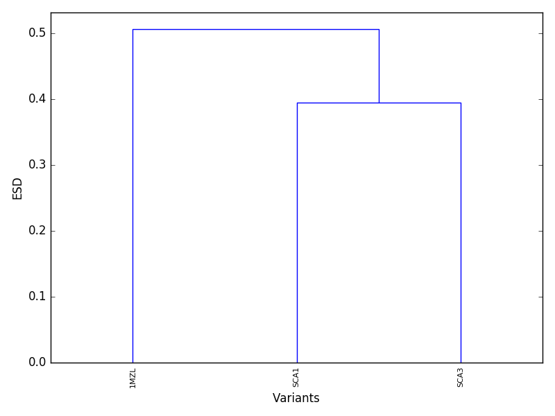
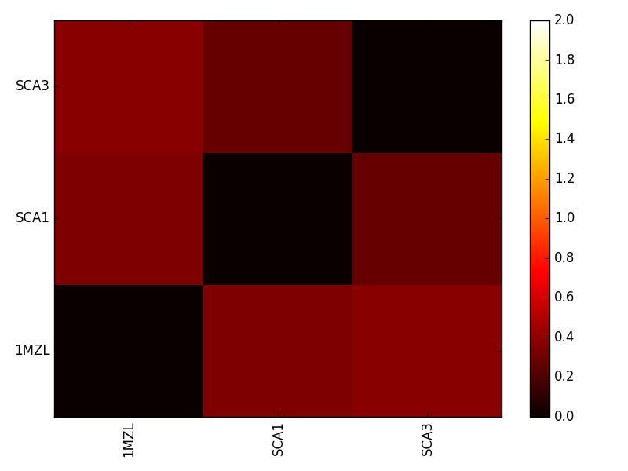

.. _elecsimilarity::

Electrostatic Similarity
========================

The electrostatic similarity method generates grid potentials for a list of PDB files and compares 
all potential files in a pairwise manner. Here we will provide a test case that compares several 
members of a family of plant proteins. This example is based on a more comprehensive, published study [Chae2010]_.

.. currentmodule:: aesop
.. autosummary::
    :toctree: api/generated/
    
    ElecSimilarity
    
Example case 1: LTP plant proteins
""""""""""""""""""""""""""""""""""

Open a new python session, import the ElecSimilarity class, and import the plotDend and plotESD functions:: 

    from aesop import ElecSimilarity, plotDend, plotESD

Next, you must specify the full paths to your ``apbs`` and ``pdb2pqr`` executables, if 
the paths for the directories containing the executables have not already been added to the environment. 
Here is an example for a Windows system::

    path_apbs    = 'C:\\APBS\\apbs.exe'
    path_pdb2pqr = 'C:\\PDB2PQR\\pdb2pqr.exe'

Now we will specify what PDB files the method should compare. Here we will use only 3 PDB files 
(:download:`download<../data/LTP_pdb.zip>`). After downloading the PDB files, unzip them and place 
them in the current working directory::

    pdbfiles = ['1MZL.pdb', 'SCA1.pdb', 'SCA3.pdb']

.. warning::

    If you are using your own PDB, make sure the PDB contains no missing heavy atoms. Consider also removing non-standard
    amino acids. PDBFixer is one option for cleaning PDB files in preparation for AESOP.

.. note::

    If you only provide a single PDB file, AESOP will generate a library of mutants by side-chain truncation
    as in the Alascan class. You can force the ElecSimilarity class to generate mutants for all structures 
    by specifying a list of selection strings that describe all regions of the PDB to mutate.

When the method is run, intermediate files will be generated and stored in a folder of the current 
working directory. The user has the option of naming this folder by specifying a job name::

    jobname = 'LTP_test1'

Next, the method is initialized by::

    family = ElecSimilarity(pdbfiles=pdbfiles, pdb2pqr_exe=path_pdb2pqr, apbs_exe=path_apbs, 
                            jobname=jobname)

Finally, we are ready to run the analysis. To superpose structures before running, set superpose 
to True. To center structures before running, set center to True. Ideally, the end user should 
ensure that all PDB structures have consistent coordinates. This analysis will take several minutes, 
so please be patient::

    family.run(superpose=True, center=False)

.. warning::

    Currently, superpositioning will fail for structures with an unequal number of alpha carbon atoms. For more complicated 
    schemes, we suggest the user superposition all structures before running AESOP. For instance, the user may be want to 
    superpose by domain.

After the run is complete, AESOP will report if any Warnings or Errors were detected in APBS or PDB2PQR. 
The full logs are stored in the family.logs and can be viewed or written to file in the following manner::

    family.viewLogs()
	family.writeLogs(filename="family_logs.txt")
    
You can view results using built-in functions::

    plotDend(family, filename='dend.png')
    plotESD(family, filename='esd.png')

plotDend should produce a dendrogram similar to the following figure.

Proteins that cluster together at lower ESD in the dendrogram are expected to be electrostatically similar.

plotESD should produce a heatmap similar to the following figure.

   
This heatmap compares all protein pairs in terms of ESD. Lower values once again indicate electrostatic similarity.
   
If you prefer to export the raw data, you can access the ESD matrix::

    data = family.esd

Other modules such as numpy (example below) or pandas will allow exporting of the ESD matrix to file::

    import numpy as np
    np.savetxt('esd_matrix.txt', data, fmt='%.4f')
	
The ElecSimilarity class also supports calculation of the electrostatic similarity index (ESI) by comparing
potentials across all protein structures at corresponding grid points. If you previously calculated the ESD,
then you need type the following to perform this calculation::

    family.calcESI()
	
If you prefer to calculate ESI instead of ESD, you may do so at the time you run the analysis::

    family.run(esi=True, esd=False, superpose=True)
    family.run_parallel(esi=True, esd=False, superpose=True)
	
After performing the ESI calculation, you may view the ESI values by loading the DX file that is located
within the "esi_files" folder of the job directory.

Example case 2: Alascan of a LTP plant protein
""""""""""""""""""""""""""""""""""""""""""""""

AESOP is additionally capapable of comparing electrostatic potentials of alanine mutants for a protein structure. 
The process follows many of the same steps from example case 1::

    from aesop import ElecSimilarity, plotDend, plotESD
    
    path_apbs    = 'C:\\APBS\\apbs.exe'
    path_pdb2pqr = 'C:\\PDB2PQR\\pdb2pqr.exe'
    pdbfiles     = ['1MZL.pdb']
    jobname      = 'LTP_test2'
    
    family = ElecSimilarity(pdbfiles=pdbfiles, pdb2pqr_exe=path_pdb2pqr, apbs_exe=path_apbs, jobname=jobname)

The analysis can be run with the same ``run`` or ``run_parallel`` methods as before; however, AESOP will only know to 
generate a family of alanine mutants if the length of the ``pdbfiles`` is 1 or if ``selstr`` is specified in the run statement. 
``selstr`` will tell AESOP to mutate all ionizable amino acids selected by any of the elements of the list. Only one amino 
acid will be mutated at a time. The following is an example run statement that will generate mutants for all ionizable amino acids 
in the 1MZL pdb file::

    family.run(superpose=False, esd=True, esi=True, selstr=['protein'])

References
""""""""""

.. [Chae2010] `Chae, K., B.J. Gonong, S.C. Kim, C.A. Kieslich, D. Morikis, S. Balasubramanian, and E.M. Lord. 2010. A multifaceted study of stigma/style cysteine-rich adhesin (SCA)-like Arabidopsis lipid transfer proteins (LTPs) suggests diversified roles for these LTPs in plant growth and reproduction. J. Exp. Bot. 61: 4277–4290 <https://doi.org/10.1093/jxb/erq228>`_.