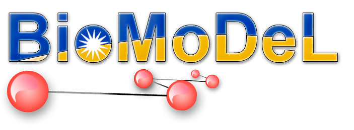

.. _index::

**AESOP**
=========

A python library for studying electrostatics in proteins
""""""""""""""""""""""""""""""""""""""""""""""""""""""""

AESOP is developed and maintained by members of the Biomolecular Modeling and Design Lab at the 
University of California, Riverside, including: Reed Harrison, Rohith Mohan, and Dimitrios Morikis.

**Indices and tables**

* :ref:`genindex`
* :ref:`modindex`
* :ref:`search`

Project summary
===============

For many proteins complexes, long range electrostatic interactions play a pivotal role in the formation 
of the encounter complex. Charge-charge interactions can also serve to thermodynamically stabilize any 
resulting complex. In many cases, however, optimization of a protein associating with its binding partner 
is sufficient to increase protein activity as many protein systems are diffusion limited. The AESOP 
framework provides a tool to investigate the electrostatic nature of protein interactions both across
protein families as well as within indivdiual proteins in terms of individual amino acid contributions.

AESOP is implemented in Python 2.7 and depends on a number of computational tools including: APBS, 
PDB2PQR, ProDy, Modeller, and gridDataFormats. Documentation can be found at `aesop.readthedocs.io 
<aesop.rtfd.io>`_. We welcome questions and collaboration on the GitHub page for AESOP at 
`https://github.com/rohithmohan/aesop <https://github.com/rohithmohan/aesop>`_.

Methods
"""""""

AESOP currently supports three computational methods:

- **Alascan**
	- Perform a computational alanine scan on a provided protein structure using a side-chain truncation scheme
	- Association free energies for mutatants (relative to the parent) may be predicted if 2 or more selection strings are provided
	- Users may restrict mutations to some region of the protein structure

- **DirectedMutagenesis**
	- Perform a directed mutagenesis scan on a provided protein structure using Modeller to swap amino acids
	- Association free energies for mutatants (relative to the parent) may be predicted if 2 or more selection strings are provided
	- Mutations must be specified

- **ElecSimilarity**
	- Compare electrostatic potentials of multiple protein structures
	- If structures are very dissimilar, the user should superpose coordinates for each protein structure according to their desired method

General Utilities
"""""""""""""""""

In addition to the three main computational methods, AESOP provides a total of three functions capable 
of displaying results as figures during interactive Python sessions or saving results as figures during 
any Python script:

- aesop.plotScan()
	- Show bargraph summary of results from computational mutagenesis methods (Alascan, DirectedMutagenesis)
- aesop.plotESD()
 	- Show heatmap summary of results from methods exploring electrostatic similarity (ElecSimilarity)
- aesop.plotDend()
 	- Show dendrogram summary of results from methods exploring electrostatic similarity (ElecSimilarity)

Notes
"""""
- We recommend using Anaconda to aid in installation of Python scientific libraries
- Depending on your platform, ProDy may need to be installed with an executable

Contents
""""""""

.. toctree::
   :maxdepth: 1

   about
   installation
   selections
   elecsimilarity
   alascan
   directmutagenesis
   aesop